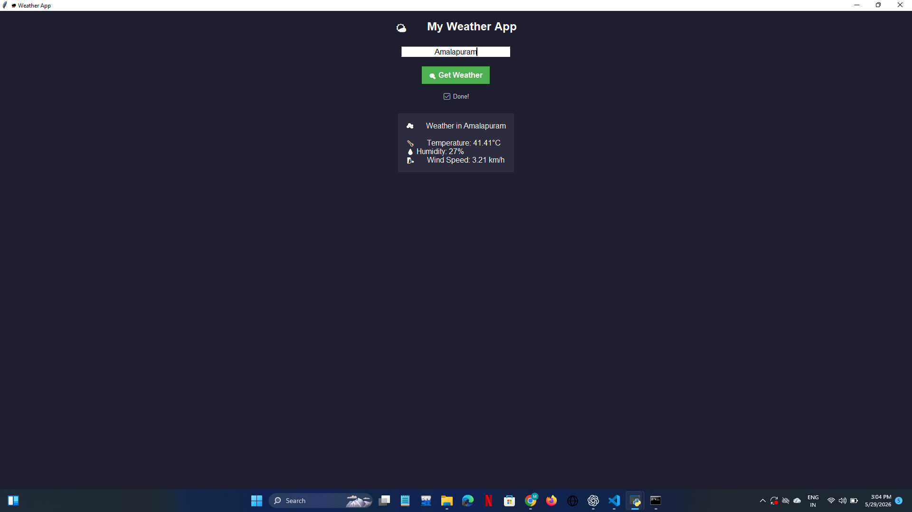

# 🌦️ Weather App

A simple Weather App built using Python and Tkinter.

## 🚀 Features
- 🌍 Search weather by city
- 🌡️ Temperature display
- 💧 Humidity information
- 🌬️ Wind speed
- 🎨 Emoji-rich GUI
- 🌙 Dark theme interface

## 📸 Screenshot

## 🛠️ Tech Stack
- Python
- Tkinter
- Requests
- OpenWeather API

## 👩‍💻 Author
Mahathi Savinya